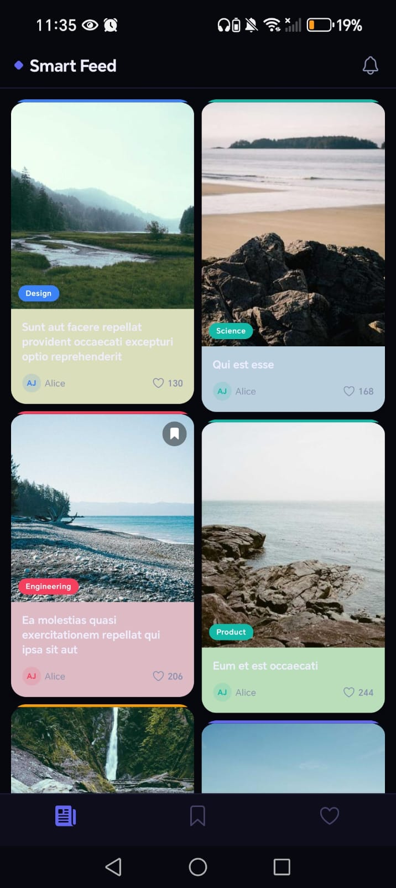
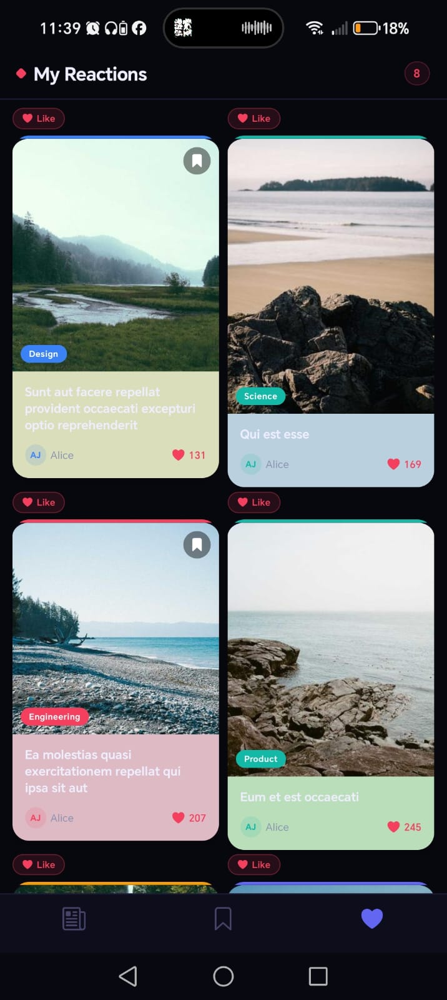
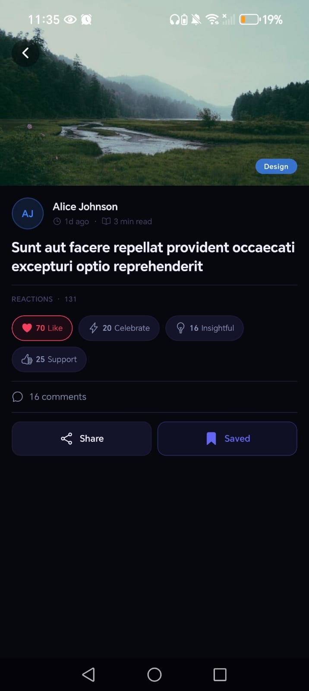
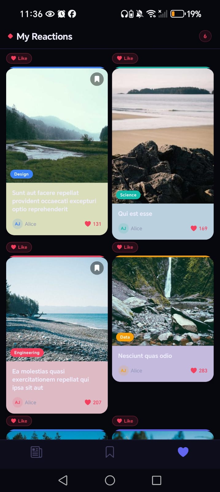
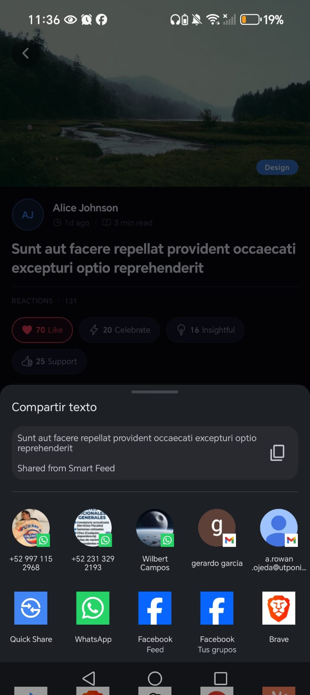
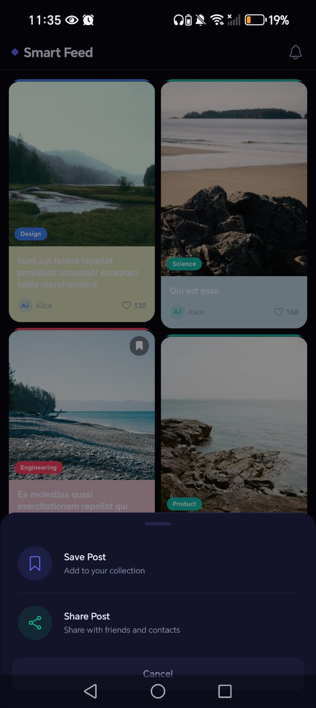

# Smart Feed — Prueba Técnica React Native

Aplicación móvil con feed infinito de posts multimedia (imagen + texto), caché offline progresiva, animaciones fluidas y arquitectura modular escalable.

---

## Screenshots

<table>
  <tr>
    <td align="center"><b>Home</b></td>
    <td align="center"><b>Favoritos</b></td>
    <td align="center"><b>Detalle de imagen</b></td>
  </tr>
  <tr>
    <td></td>
    <td></td>
    <td></td>
  </tr>
  <tr>
    <td align="center"><b>Reacciones</b></td>
    <td align="center"><b>Compartir</b></td>
    <td align="center"><b>Compartir y guardar</b></td>
  </tr>
  <tr>
    <td></td>
    <td></td>
    <td></td>
  </tr>
</table>

---

## Decisiones técnicas

| Área | Elección | Justificación |
|---|---|---|
| **Estado** | Zustand | Sin boilerplate, performante con slices, integración directa con MMKV |
| **Persistencia** | react-native-mmkv | El storage más rápido en RN (síncrono), aguanta 10k+ posts |
| **Navegación** | React Navigation 6.x | Requerido. Stack + BottomTabs |
| **Animaciones** | react-native-reanimated v3 | Requerido. JS thread → UI thread, sin jank |
| **Gestos** | react-native-gesture-handler | Requerido. Swipeable altamente personalizado |
| **Imágenes** | react-native-fast-image + estrategia custom | Caché disk nativa + preload + cancelación de peticiones |
| **Red** | @react-native-community/netinfo | Requerido. Detección de conectividad + backoff exponencial |
| **Tests** | @testing-library/react-native | Requerido. Unit + integración |
| **API** | Mock local (JSONPlaceholder + Lorem Picsum) | Latencia artificial ≥ 500ms + 10% errores aleatorios |

---

## Arquitectura

```
src/
├── api/
│   ├── feedApi.ts          # Llamadas HTTP, paginación, mock de latencia/errores
│   └── mockServer.ts       # Generador de posts con datos falsos
├── storage/
│   ├── mmkvStorage.ts      # Wrapper MMKV para posts paginados
│   └── offlineQueue.ts     # Cola de acciones offline (likes, favoritos)
├── store/
│   ├── feedStore.ts        # Estado del feed: posts, página, status, concurrencia
│   └── offlineStore.ts     # Estado de la cola offline, persistido en MMKV
├── hooks/
│   ├── useFeed.ts          # Orquesta feedStore + caché + red
│   ├── useNetworkStatus.ts # isConnected, wasOffline
│   └── useOfflineSync.ts   # Dispara sync al reconectar
├── services/
│   ├── networkService.ts   # NetInfo + backoff exponencial
│   └── syncService.ts      # Vacía offlineQueue y sincroniza con API
├── components/
│   ├── PostCard/           # Tarjeta individual (memo, animaciones, swipeable)
│   ├── FeedList/           # FlatList optimizado con todos los estados
│   └── LoadingStates/      # Skeleton, error, empty, footer loader
├── screens/
│   └── FeedScreen.tsx      # Pantalla principal
├── navigation/
│   └── AppNavigator.tsx    # Stack + BottomTabs
├── types/
│   ├── post.ts             # Post, PostStatus, LikeAction
│   └── api.ts              # FeedResponse, PaginationParams
└── utils/
    ├── imageCache.ts       # Precarga y cancelación de imágenes
    └── backoff.ts          # Utilidad de backoff exponencial

native/
├── android/
│   └── AverageColorModule.java   # Módulo nativo Android (ver Paso 14)
└── ios/
    └── AverageColorModule.swift  # Módulo nativo iOS (ver Paso 14)

__tests__/
├── unit/
│   ├── pagination.test.ts        # Lógica de paginación y concurrencia
│   └── offlineSync.test.ts       # enqueue / flush de acciones offline
└── integration/
    └── FeedScreen.test.tsx       # Render principal, scroll, estados
```

---

## Plan de desarrollo paso a paso

### Paso 1 — Instalación de dependencias

```bash
npm install \
  @react-navigation/native \
  @react-navigation/stack \
  @react-navigation/bottom-tabs \
  react-native-screens \
  react-native-safe-area-context \
  react-native-reanimated \
  react-native-gesture-handler \
  zustand \
  react-native-mmkv \
  react-native-fast-image \
  @react-native-community/netinfo

npm install --save-dev \
  @testing-library/react-native \
  @testing-library/jest-native
```

Configurar `babel.config.js` con el plugin de reanimated **al final** del array de plugins:

```js
plugins: ['react-native-reanimated/plugin']
```

Agregar en `tsconfig.json`:

```json
{
  "compilerOptions": {
    "baseUrl": ".",
    "paths": { "@/*": ["src/*"] }
  }
}
```

---

### Paso 2 — Tipos del dominio

**`src/types/post.ts`**

```ts
export interface Post {
  id: string;
  title: string;
  imageUrl: string;
  likes: number;
  createdAt: string;
}

export type FeedStatus = 'idle' | 'loading' | 'error' | 'empty';

export interface LikeAction {
  postId: string;
  timestamp: number;
}
```

**`src/types/api.ts`**

```ts
export interface FeedResponse {
  page: number;
  posts: Post[];
  hasNextPage: boolean;
}

export interface PaginationParams {
  page: number;
  limit?: number;
}
```

---

### Paso 3 — API Layer

**`src/api/feedApi.ts`** — Mock local con latencia artificial y fallos aleatorios:

- Latencia fija: `await delay(500 + Math.random() * 300)`
- Fallo aleatorio: `if (Math.random() < 0.1) throw new Error('Random API error')`
- Datos: JSONPlaceholder `/posts` + imágenes de `https://picsum.photos/id/{n}/600/400`
- Paginación: devuelve `{ page, posts, hasNextPage }` según el offset

**`src/api/mockServer.ts`** — Generador de 100 posts estáticos con IDs y datos de Lorem Picsum.

---

### Paso 4 — Storage Layer

**`src/storage/mmkvStorage.ts`**

- Instancia global de MMKV: `new MMKV({ id: 'feed-storage' })`
- `savePosts(posts: Post[])` — serializa y guarda en clave `'cached_posts'`
- `loadPosts(): Post[]` — deserializa al arranque (instantáneo, síncrono)
- `clearPosts()` — limpia al pull-to-refresh si hay red

**`src/storage/offlineQueue.ts`**

- Usa la misma instancia MMKV, clave `'offline_queue'`
- `enqueue(action: LikeAction)` — agrega a la cola
- `dequeue(): LikeAction[]` — retorna y vacía la cola
- `peek(): LikeAction[]` — lectura sin consumir

---

### Paso 5 — State Management con Zustand

**`src/store/feedStore.ts`**

```ts
interface FeedState {
  posts: Post[];
  page: number;
  hasNextPage: boolean;
  status: FeedStatus;
  isFetching: boolean;   // guard de concurrencia
  loadMore: () => Promise<void>;
  refresh: () => Promise<void>;
  retry: () => Promise<void>;
  hydrateFromCache: () => void;
}
```

- `loadMore` verifica `isFetching` antes de llamar a la API → evita peticiones simultáneas
- `refresh` reinicia `page = 1` y limpia `posts`
- `hydrateFromCache` carga posts de MMKV en el mount inicial

**`src/store/offlineStore.ts`**

```ts
interface OfflineState {
  queue: LikeAction[];
  enqueue: (action: LikeAction) => void;
  flush: () => LikeAction[];
  clear: () => void;
}
```

- Estado persistido en MMKV via middleware de Zustand

---

### Paso 6 — Servicios de red y sincronización

**`src/services/networkService.ts`**

- Suscripción a `NetInfo.addEventListener`
- Al detectar reconexión, espera con backoff exponencial antes de reintentar (base 1s, max 30s)
- Expone `onReconnect(callback)` para que `syncService` se suscriba

**`src/services/syncService.ts`**

- Al reconectar: `offlineQueue.dequeue()` → envía cada acción a la API
- Si la API falla: re-encola con reintentos limitados (max 3)
- Al completarse: dispara `feedStore.refresh()` para actualizar datos

---

### Paso 7 — Custom Hooks

**`src/hooks/useNetworkStatus.ts`**

```ts
const { isConnected, wasOffline } = useNetworkStatus();
```

- `wasOffline`: true si la sesión pasó por estado offline (para mostrar banner)

**`src/hooks/useOfflineSync.ts`**

- Efecto que escucha `isConnected`: cuando pasa de `false → true`, llama a `syncService.sync()`

**`src/hooks/useFeed.ts`**

- Combina `feedStore` + `hydrateFromCache` en el mount
- Expone `{ posts, status, loadMore, refresh, retry }`

---

### Paso 8 — Componente PostCard

**`src/components/PostCard/PostCard.tsx`**

Estructura:

```
<GestureDetector gesture={swipeGesture}>
  <Animated.View style={[cardStyle, swipeStyle]}>
    <Animated.View style={fadeSlideStyle}>          ← animación de entrada
      <Pressable onPressIn/onPressOut>              ← press feedback (scale)
        <FastImage source={{ uri }} priority="normal" cache="immutable" />
        <View>
          <Text>{title}</Text>
          <Text>{likes} likes · {date}</Text>
        </View>
      </Pressable>
    </Animated.View>
    <SwipeActionButton label="Favorito" />           ← oculto hasta swipe
  </Animated.View>
</GestureDetector>
```

- `React.memo` con comparator que compara solo `id`, `likes` y `title`
- **Animación de entrada**: `useSharedValue(0)` → `withTiming(1, { duration: 300 })` en opacity + translateY
- **Press feedback**: `withSpring(0.96)` en scale al `onPressIn`, `withSpring(1)` al `onPressOut`
- **Swipeable**: `Pan gesture` con `translationX` → al superar -80px revela botón "Favorito"
- Accesibilidad: `accessible={true}`, `accessibilityLabel={title}`, `accessibilityRole="button"`

---

### Paso 9 — Componente FeedList

**`src/components/FeedList/FeedList.tsx`**

```tsx
<FlatList
  data={posts}
  renderItem={({ item }) => <PostCard post={item} />}
  keyExtractor={item => item.id}
  onEndReached={loadMore}
  onEndReachedThreshold={0.4}
  refreshControl={<RefreshControl refreshing={isRefreshing} onRefresh={refresh} />}
  removeClippedSubviews={true}
  windowSize={5}
  initialNumToRender={5}
  maxToRenderPerBatch={5}
  getItemLayout={(_, index) => ({ length: ITEM_HEIGHT, offset: ITEM_HEIGHT * index, index })}
  ListFooterComponent={<FooterLoader status={status} onRetry={retry} />}
  ListEmptyComponent={<EmptyState status={status} />}
/>
```

- `ITEM_HEIGHT` constante calculada para `getItemLayout` (imagen 600/400 ratio + padding)
- Footer muestra: spinner de carga, botón "Reintentar" en error, nada si no hay más páginas

---

### Paso 10 — Soporte de orientación

En `PostCard`:

```ts
const { width } = useWindowDimensions();
const imageHeight = (width * 400) / 600; // mantiene ratio 3:2
```

En `FeedList`:

```ts
const { width } = useWindowDimensions();
// extraData solo cambia cuando cambia la orientación → evita re-renders innecesarios
<FlatList extraData={width} ... />
```

Para preservar posición del scroll: guardar el índice visible en `onViewableItemsChanged` y restaurar con `scrollToIndex` al detectar cambio de orientación.

---

### Paso 11 — Estrategia de imágenes

**`src/utils/imageCache.ts`**

- **Precarga**: al cargar un batch, `FastImage.preload(nextBatchUrls)` en background
- **Caché**: `FastImage` con `cache: 'immutable'` → guarda en disco, no descarga dos veces
- **Cancelación**: `AbortController` por petición de imagen en el hook de carga; cancelado en `useEffect` cleanup

**Módulo nativo `getAverageColor` (mock funcional):**

```ts
// Mock JS: calcula color basado en el ID de la imagen
export function getAverageColor(imageUri: string): string {
  const id = extractPicsumId(imageUri);
  const hue = (id * 137) % 360; // distribución pseudo-aleatoria
  return `hsl(${hue}, 40%, 85%)`;
}
```

> La implementación nativa real está documentada en el Paso 14.

---

### Paso 12 — Navegación

**`src/navigation/AppNavigator.tsx`**

```tsx
<NavigationContainer>
  <Stack.Navigator>
    <Stack.Screen name="Feed" component={FeedScreen} />
  </Stack.Navigator>
</NavigationContainer>
```

**`App.tsx`** — wrappear todo en:

```tsx
<GestureHandlerRootView style={{ flex: 1 }}>
  <AppNavigator />
</GestureHandlerRootView>
```

---

### Paso 13 — Tests

**`__tests__/unit/pagination.test.ts`**
- Verifica que `loadMore` no hace segunda petición si `isFetching === true`
- Verifica que `page` incrementa correctamente al recibir respuesta
- Verifica comportamiento de `retry` después de error

**`__tests__/unit/offlineSync.test.ts`**
- Verifica `enqueue` → `peek` → `dequeue` cycle
- Verifica que al reconectar, `syncService` vacía la cola
- Verifica re-encola en fallo de API

**`__tests__/integration/FeedScreen.test.tsx`**
- Renderiza `FeedScreen` con API mockeada
- Verifica que aparecen posts tras la carga inicial
- Verifica estado de loading durante la petición
- Verifica estado de error con botón retry visible

---

### Paso 14 — Módulo nativo `getAverageColor` (opcional, muy valorado)

#### Android — `native/android/AverageColorModule.java`

```java
@ReactMethod
public void getAverageColor(String imageUri, Promise promise) {
    Bitmap bitmap = BitmapFactory.decodeFile(imageUri);
    Palette palette = Palette.from(bitmap).generate();
    int dominant = palette.getDominantColor(Color.WHITE);
    promise.resolve(String.format("#%06X", (0xFFFFFF & dominant)));
}
```

Requiere: `implementation 'androidx.palette:palette:1.0.0'`

#### iOS — `native/ios/AverageColorModule.swift`

```swift
@objc func getAverageColor(_ uri: String, resolve: @escaping RCTPromiseResolveBlock, reject: @escaping RCTPromiseRejectBlock) {
    let filter = CIFilter(name: "CIAreaAverage")!
    let image = CIImage(contentsOf: URL(string: uri)!)!
    filter.setValue(image, forKey: kCIInputImageKey)
    filter.setValue(CIVector(cgRect: image.extent), forKey: "inputExtent")
    let output = filter.outputImage!
    // extraer RGB del pixel resultante y convertir a hex
    resolve(hexFromCIImage(output))
}
```

---

### Paso 15 — Polish y validación final

- [ ] Ejecutar `npx react-native run-android` con Perf Monitor abierto → verificar 60fps en scroll
- [ ] Desconectar red en emulador → verificar posts desde caché, dar like, reconectar → verificar sincronización del like
- [ ] Rotar emulador → verificar que imágenes se redimensionan y scroll no salta
- [ ] Activar TalkBack (Android) / VoiceOver (iOS) → verificar que cada post se lee correctamente
- [ ] Ejecutar `npm test` → todos los tests en verde

---

## Cómo ejecutar el proyecto

```bash
# Instalar dependencias
npm install

# iOS (solo Mac)
bundle exec pod install
npm run ios

# Android
npm run android

# Tests
npm test
```

## Estructura de la respuesta de la API

```json
{
  "page": 1,
  "posts": [
    {
      "id": "123",
      "title": "Post title",
      "imageUrl": "https://picsum.photos/id/1/600/400",
      "likes": 42,
      "createdAt": "2023-01-01T00:00:00Z"
    }
  ],
  "hasNextPage": true
}
```
