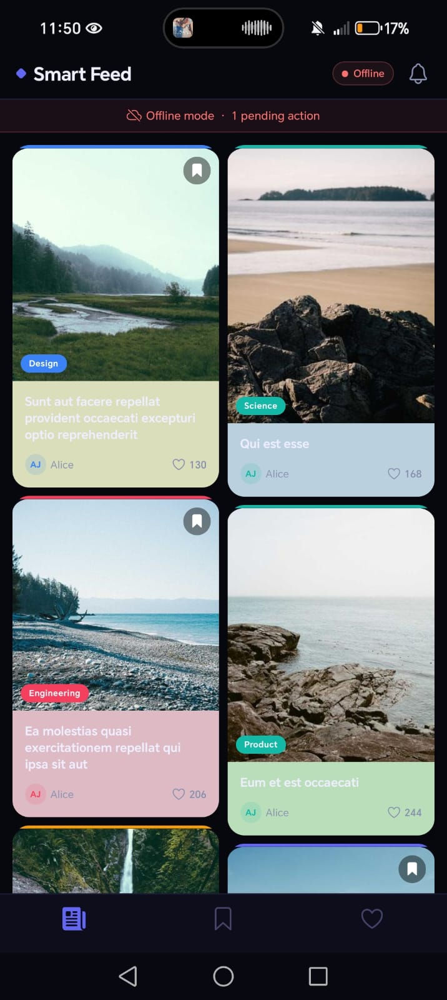

# Smart Feed — Prueba Técnica React Native

Aplicación móvil de feed infinito multimedia (imagen + texto) construida como solución a la prueba técnica "Smart Feed". Cumple con todos los requisitos obligatorios, las capas de complejidad y los extras solicitados.

---

## Screenshots

<table>
<tr>
<td align="center"><b>Home</b></td>
<td align="center"><b>Favoritos</b></td>
<td align="center"><b>Detalle de imagen</b></td>
</tr>
<tr>
<td></td>
<td></td>
<td></td>
</tr>
<tr>
<td align="center"><b>Reacciones</b></td>
<td align="center"><b>Compartir</b></td>
<td align="center"><b>Compartir y guardar</b></td>
</tr>
<tr>
<td></td>
<td></td>
<td></td>
</tr>
<tr>
<td align="center"><b>Modo offline</b></td>
<td></td>
<td></td>
</tr>
<tr>
<td></td>
<td></td>
<td></td>
</tr>
</table>

---

## Funcionalidades implementadas

### Obligatorias

| Requisito | Implementación |
|---|---|
| **Carga paginada e infinita** | `MasonryFlashList` con `onEndReached` — carga de 10 posts por página desde JSONPlaceholder |
| **Manejo de estados** | `FeedStatus`: `idle`, `loading`, `error`, `empty` con skeleton, pantalla de error y botón retry |
| **Control de concurrencia** | Flag `isFetching` en el store + `AbortController` por página para cancelar peticiones en vuelo |
| **Pull-to-refresh** | `RefreshControl` integrado que reinicia paginación y limpia caché de disco |
| **Caché offline progresiva** | Posts persistidos en MMKV (`mmkvStorage.ts`) — se hidratan al abrir la app sin red |
| **Sincronización offline** | Cola de acciones (`offlineQueue.ts`) — al reconectar, `syncService.ts` vacía la cola con backoff exponencial |
| **Animaciones suaves** | `react-native-reanimated`: fade-in + spring en cada `PostCard`, press feedback con scale |
| **Soporte de orientación** | `useWindowDimensions` en `FeedList` y `PostDetailScreen` — redimensionado inmediato sin recarga |
| **Accesibilidad** | `accessibilityRole`, `accessibilityLabel`, `accessibilityHint`, `accessibilityLiveRegion` en componentes clave |

### Capas de complejidad

| Capa | Implementación |
|---|---|
| **Rendimiento de lista** | `MasonryFlashList` (@shopify/flash-list) con `estimatedItemSize`, 2 columnas masonry |
| **Caché de imágenes** | `expo-image` con `prefetch(url, 'disk')` para precarga + `clearMemoryCache()` al ir a background + `clearDiskCache()` en pull-to-refresh |
| **Manejo de estado** | **Zustand** — elegido por su API minimal, sin boilerplate, soporte de selectors estables y fácil integración con persistencia externa (MMKV). Escala a 10k+ posts con estado normalizado (`postsById`) |
| **Estado normalizado** | `postsById: Record<string, Post>` para O(1) en lookups y toggle de reacciones; `pages: Record<number, string[]>` para reconstruir orden |
| **Módulo nativo** | `getAverageColor(imageUri)` implementado en Java (Android — Palette API) y Swift (iOS — CIAreaAverage). Mock JS funcional como fallback |
| **Pruebas** | Unitarias de paginación y offline sync + Integración de FeedScreen con `@testing-library/react-native` |

### Extra

| Feature | Implementación |
|---|---|
| **Gestos complejos (Swipeable)** | `Swipeable` de `react-native-gesture-handler` — al deslizar un post aparece un `SwipeActionSheet` con opciones de Guardar y Compartir |
| **Reacciones múltiples** | 4 tipos: Like, Celebrate, Insightful, Support — con `ReactionPicker` modal animado (long press) |
| **Bookmarks persistentes** | Tab "Saved" con posts guardados en MMKV — persisten entre sesiones |
| **Tab "My Reactions"** | Filtra posts con `userReaction !== null` y muestra badge de tipo de reacción |
| **Pantalla de detalle** | Hero image responsiva, breakdown de reacciones, compartir nativo (`Share.share`), bookmark toggle |
| **Tema oscuro centralizado** | `src/theme/index.ts` con colores, spacing, radius y tipografía consistentes |

---

## Decisiones técnicas

### Estado: Zustand sobre Redux Toolkit

Se eligió **Zustand** por:
- API minimal sin actions/reducers boilerplate
- Selectors granulares que evitan re-renders innecesarios
- Acceso directo al store fuera de React (`useFeedStore.getState()`) útil para sync service
- Fácil integración con MMKV para persistencia selectiva
- Estado normalizado (`postsById`) que escala a 10k+ posts con lookups O(1)

### Persistencia: MMKV sobre AsyncStorage

Se eligió **react-native-mmkv** por:
- Escritura/lectura síncrona (no async) — hidratación instantánea al abrir la app
- Rendimiento ~30x superior a AsyncStorage
- Soporta múltiples instancias con IDs separados
- No requiere schema como SQLite/WatermelonDB para el volumen de datos del feed

### Lista: MasonryFlashList sobre FlatList

Se eligió **@shopify/flash-list** por:
- Reciclaje de celdas eficiente que mantiene 60 fps
- Soporte nativo para masonry layout (2 columnas con alturas variables)
- `estimatedItemSize` para layout anticipado sin saltos

### Imágenes: expo-image con estrategia propia

Estrategia implementada:
1. **Precarga** (`Image.prefetch(url, 'disk')`) tras cada batch de la API
2. **Precarga predictiva** de las 6 imágenes siguientes al último item visible (`onViewableItemsChanged`)
3. **Liberación de RAM** al ir a background (`clearMemoryCache`) — disco preservado para offline
4. **Limpieza total** solo en pull-to-refresh explícito del usuario
5. **`cachePolicy="disk"`** en cada `Image` para priorizar caché persistente

### Caché de imágenes: No se usó react-native-fast-image

Se prefirió `expo-image` porque:
- Integración nativa con Expo (no requiere configuración nativa extra)
- API de prefetch con soporte explícito para disco vs memoria
- `clearMemoryCache()` / `clearDiskCache()` para control granular del ciclo de vida

### Detección de red + reconexión

- `@react-native-community/netinfo` para estado de conectividad en tiempo real
- `networkService.ts` con patrón observer para callbacks de reconexión
- `syncService.ts` con backoff exponencial (base 1s, max 30s, 3 intentos) para vaciar la cola offline
- Acciones fallidas se re-encolan automáticamente para no perder datos

### Módulo nativo: getAverageColor

| Plataforma | Implementación |
|---|---|
| **Android** | `Palette` API de AndroidX — extrae color dominante de un `Bitmap` decodificado |
| **iOS** | `CIAreaAverage` de Core Image — renderiza a bitmap 1x1 y devuelve el color promedio |
| **JS (fallback)** | Deriva un color HSL pseudo-aleatorio desde el ID de la imagen de Picsum — usado mientras el bridge nativo no está configurado |

El color extraído se usa como fondo del contenido textual del post, creando un efecto visual cohesivo entre imagen y texto.

---

## Arquitectura

```
src/
├── api/
│   ├── feedApi.ts              # Fetch paginado desde JSONPlaceholder, AbortController, latencia 500ms+, 10% errores
│   └── mockServer.ts           # Generador de 200 posts con datos falsos (fallback offline)
├── storage/
│   ├── mmkvStorage.ts          # Wrapper MMKV: save/load/clear de posts paginados
│   ├── offlineQueue.ts         # Cola persistida en MMKV para acciones offline (reacciones)
│   └── bookmarkStorage.ts      # Persistencia de bookmarks en MMKV
├── store/
│   ├── feedStore.ts            # Estado normalizado del feed: postsById, pages, status, concurrencia
│   ├── offlineStore.ts         # Estado de la cola offline con enqueue/flush/clear
│   └── bookmarkStore.ts        # Estado de bookmarks con toggle persistido
├── hooks/
│   ├── useFeed.ts              # Orquesta feedStore + caché + hidratación + cleanup
│   ├── useNetworkStatus.ts     # isConnected, wasOffline via NetInfo
│   └── useOfflineSync.ts       # Dispara syncOfflineQueue al reconectar
├── services/
│   ├── networkService.ts       # NetInfo + patrón observer para callbacks de reconexión
│   └── syncService.ts          # Vacía offlineQueue con backoff exponencial y re-intenta fallidos
├── components/
│   ├── PostCard/
│   │   ├── PostCard.tsx        # Tarjeta individual (React.memo + areEqual, Reanimated, Swipeable)
│   │   ├── ReactionPicker.tsx  # Modal animado con 4 tipos de reacción
│   │   └── SwipeActionSheet.tsx # Bottom sheet animado con Guardar + Compartir
│   ├── FeedList/
│   │   └── FeedList.tsx        # MasonryFlashList 2 columnas con todos los estados (skeleton, error, empty, footer)
│   └── LoadingStates/
│       ├── SkeletonCard.tsx    # Skeleton animado con pulse para estado de carga
│       ├── EmptyState.tsx      # Pantalla de estado vacío / error con retry
│       └── FooterLoader.tsx    # Footer loader / fin de feed / error de paginación
├── screens/
│   ├── FeedScreen.tsx          # Pantalla principal: header, offline banner, FeedList
│   ├── SavedScreen.tsx         # Posts guardados en grid 2 columnas
│   ├── LikesScreen.tsx         # Posts con reacción del usuario + badge de tipo
│   └── PostDetailScreen.tsx    # Detalle: hero image, reacciones, compartir, bookmark
├── navigation/
│   └── AppNavigator.tsx        # Stack + BottomTabs (Feed, Saved, Likes)
├── types/
│   ├── post.ts                 # Post, Reactions, ReactionType, ReactionAction, FeedStatus
│   └── api.ts                  # FeedResponse, PaginationParams
├── theme/
│   └── index.ts                # Colors, Spacing, Radius, Typography (dark theme)
└── utils/
    ├── imageCache.ts           # Precarga, caché en disco, cancelación de imágenes (expo-image)
    ├── backoff.ts              # Backoff exponencial: base delay, max delay, max attempts
    ├── colorExtractor.ts       # Mock JS de getAverageColor (fallback del módulo nativo)
    └── timeAgo.ts              # Formato relativo de tiempo (just now, 5m, 3h, 2d)

native/
├── android/
│   └── AverageColorModule.java # Módulo nativo Android: Palette API → color dominante
└── ios/
    ├── AverageColorModule.swift # Módulo nativo iOS: CIAreaAverage → color promedio
    └── AverageColorModule.m     # Bridge Objective-C para registro en React Native

__tests__/
├── unit/
│   ├── pagination.test.ts      # Lógica de paginación, concurrencia, estado normalizado, addReaction O(1)
│   └── offlineSync.test.ts     # enqueue/peek/dequeue + flush/clear del store offline
└── integration/
    └── FeedScreen.test.tsx     # Render principal, estados de carga, error, retry
```

---

## Stack tecnológico

| Área | Tecnología | Versión |
|---|---|---|
| Framework | React Native + Expo | RN 0.85.3 / Expo 56 |
| Navegación | React Navigation | 7.x (Stack + BottomTabs) |
| Estado | Zustand | 5.x |
| Persistencia | react-native-mmkv | 3.x |
| Lista | @shopify/flash-list | 1.7.x |
| Imágenes | expo-image | 56.x |
| Animaciones | react-native-reanimated | 4.x |
| Gestos | react-native-gesture-handler | 2.x |
| Red | @react-native-community/netinfo | 12.x |
| Testing | Jest + @testing-library/react-native | Jest 29 |

---

## API

Se consume [JSONPlaceholder](https://jsonplaceholder.typicode.com/posts) con paginación simulada (`?_page=N&_limit=10`).

Cumplimiento de requisitos de la prueba:
- **Latencia artificial** ≥ 500ms (500–800ms random) — `feedApi.ts:75`
- **10% de errores aleatorios** — `feedApi.ts:78`
- **Cancelación de peticiones** via `AbortController` por página — `feedApi.ts:67-71`

Respuesta mapeada:

```json
{
  "page": 1,
  "posts": [
    {
      "id": "1",
      "title": "Post title",
      "imageUrl": "https://picsum.photos/id/10/600/400",
      "reactions": { "like": 42, "celebrate": 5, "insightful": 12, "support": 3 },
      "userReaction": null,
      "comments": 15,
      "readTime": 4,
      "createdAt": "2025-01-01T00:00:00Z",
      "author": "Alice Johnson",
      "category": "Technology"
    }
  ],
  "hasNextPage": true
}
```

---

## Flujo offline

```
[Usuario reacciona sin red]
       │
       ▼
  offlineStore.enqueue(action)  ──▶  offlineQueue persiste en MMKV
       │
       ▼
  feedStore.addReaction()       ──▶  Actualización optimista en UI
       │
       ... usuario reconecta ...
       │
       ▼
  useOfflineSync detecta reconexión
       │
       ▼
  syncService.syncOfflineQueue()
       │
       ▼
  flush() → lista de acciones
       │
       ▼
  Por cada acción: exponentialBackoff(simulateLikeApi, 3 intentos)
       │
       ├── éxito → continúa
       └── fallo → re-enqueue para próximo intento
       │
       ▼
  Si todas OK → refresh del feed para estado actualizado del servidor
```

---

## Scripts

| Comando | Descripción |
|---|---|
| `npm start` | Inicia Metro bundler |
| `npm run android` | Ejecuta en Android (Expo) |
| `npm run ios` | Ejecuta en iOS (Expo) |
| `npm test` | Ejecuta tests (Jest) |
| `npm run lint` | Linting (ESLint) |

---

## Requisitos

- Node.js ≥ 22.11.0
- React Native 0.85.3
- Expo SDK 56
- Android Studio / Xcode para builds nativas

---

## Requisitos técnicos vs implementación

| Requisito de la prueba | Estado | Detalle |
|---|---|---|
| React Native última versión estable o Expo SDK 5x | Cumplido | RN 0.85.3 + Expo 56 |
| React Navigation (stack + tabs) | Cumplido | @react-navigation 7.x — Stack + BottomTabs |
| No usar AsyncStorage directamente | Cumplido | MMKV para toda la persistencia |
| Estrategia de caché de imágenes (precarga, disco, cancelación) | Cumplido | expo-image: prefetch disk, predictive preload, AbortController, clearMemory/ClearDisk |
| NetInfo + backoff exponencial | Cumplido | NetInfo + exponentialBackoff (1s base, 30s max, 3 attempts) |
| React.memo con comparación profunda | Cumplido | PostCard con `areEqual` custom — compara id, userReaction, reactions, isConnected |
| react-native-reanimated / gesture-handler | Cumplido | Reanimated 4.x para animaciones, Gesture Handler para Swipeable |
| API con latencia ≥ 500ms | Cumplido | 500–800ms random en feedApi.ts |
| API con 10% errores aleatorios | Cumplido | `Math.random() < 0.1` en feedApi.ts |
| Test unitario de paginación/offline | Cumplido | `__tests__/unit/pagination.test.ts` + `offlineSync.test.ts` |
| Test de integración del componente principal | Cumplido | `__tests__/integration/FeedScreen.test.tsx` |
| Arquitectura modular (API, Storage, UI, Hooks, Services) | Cumplido | Ver diagrama de arquitectura arriba |
| Módulo nativo getAverageColor | Cumplido | Java (Palette) + Swift (CIAreaAverage) + Mock JS fallback |
| Gestos complejos (Swipeable) | Cumplido | Swipeable + SwipeActionSheet animado |
